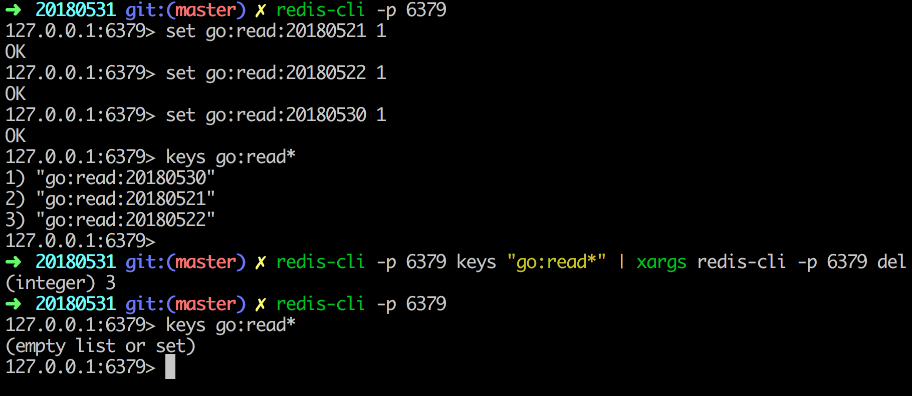
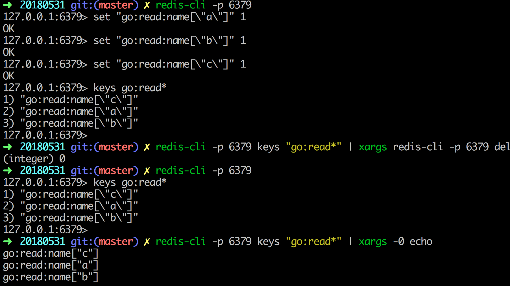

## 批量删除redis中的key

* **1.首先看图**

>* 1.我创建了三个以`go:read`开头的key
>* 2.通过`keys go:read:*`可以全部找出来
>* 3.接下来退出redis-cli,使用`redis-cli -p 6379 keys "go:read*" | xargs redis-cli -p 6379 del`可以批量删除

* **2.查看原理**

>* 1.执行`redis-cli -p 6379 keys "go:read*"`控制台输出了需要的key
>* 2.执行`redis-cli -p 6379 keys "go:read*" | xargs -0 echo`,可以看到输出了需要的key，但是有点不一样，双引号被去掉了,这说明数据通过管道传递给了xargs作了相应处理
>* 3.执行`redis-cli -p 6379 keys "go:read*" | xargs redis-cli -p 6379 del`删除了输出的key,这说明xargs对接收到数据分别进行了`redis-cli -p 6379 del`操作

* **3.遇到的问题**

>* 1.同样的原理，我设置了三个key，但是这三个key里面包含了双引号,双引号前得加上\转义符
>* 2.使用`redis-cli -p 6379 keys "go:read*" | xargs redis-cli -p 6379 del`,发现没删除
>* 3.通过`redis-cli -p 6379 keys "go:read*" | xargs -0 echo`,发现传输到xargs时把\转义符删掉了，去执行redis del操作的时候key不配，导致删除失败
>* TODO 采用xargs我没找到解决方案，希望各位大神求助,有方法了可以写在下面@～@
>* 

* **4.另一种解决方案**

>* `for i in $(redis-cli -p 6379 keys "go:read:*");do redis-cli -p 6379 del "$i";done`
>* 采用shell脚本格式 -> for循环读取key去删除