来源：《Go 夜读》微信群

时间：2018-05-28

----

## 1. 生产环境如何调试服务的内存泄露？

- pprof
- 火焰图

待补充...

如果用 gin 的话, 就一句代码.....https://github.com/DeanThompson/ginpprof

其他方法：目测法、删除法（删除怀疑的代码，然后压测）。

## 2. pprof 的数据如何实时采集到 influxdb ，有什么解决方案？

pprof 不能保存到 influxdb，想要保存的话，得使用 expvar 把 Golang 应用的内部数据传过去。

pprof 是一个运行时间段的数据，然后后续分析使用，线上应该使用 APM 方案。

>[appoptics-apm-go](https://github.com/appoptics/appoptics-apm-go)

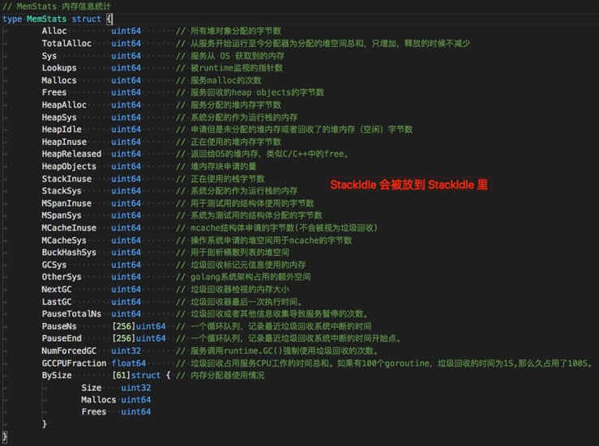

pprof 算是监控的一种，promethues 中自带的 exporter 就有监控 go runtime 的数据，比如 goroutine 数量，栈等。

## 3. 返回的 int和interface的区别，如下图：

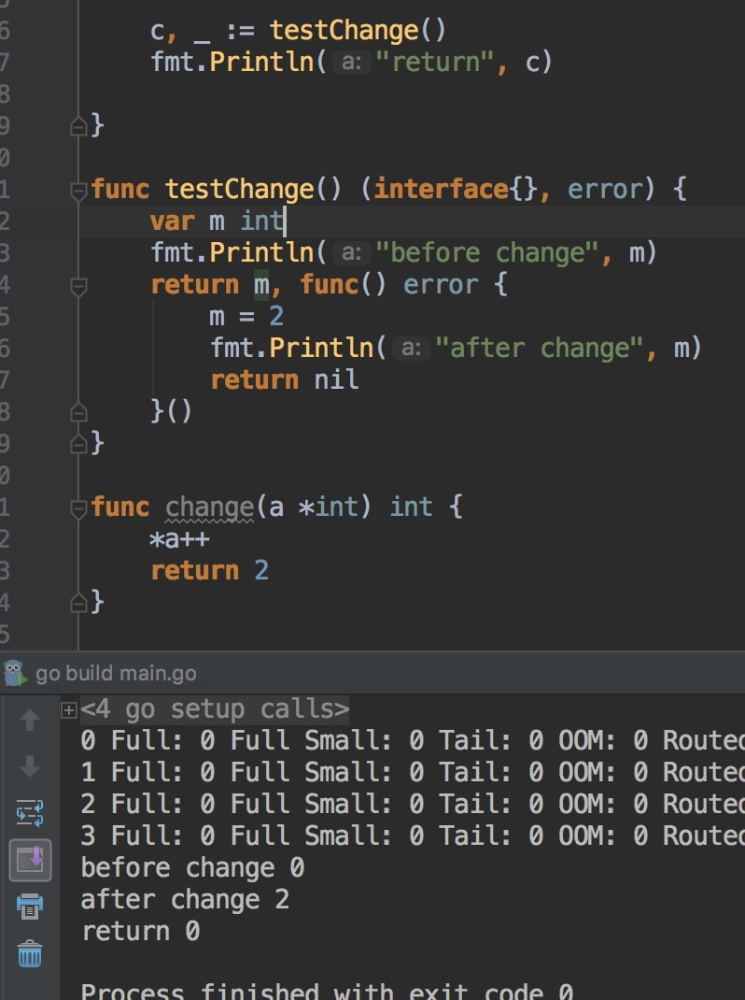
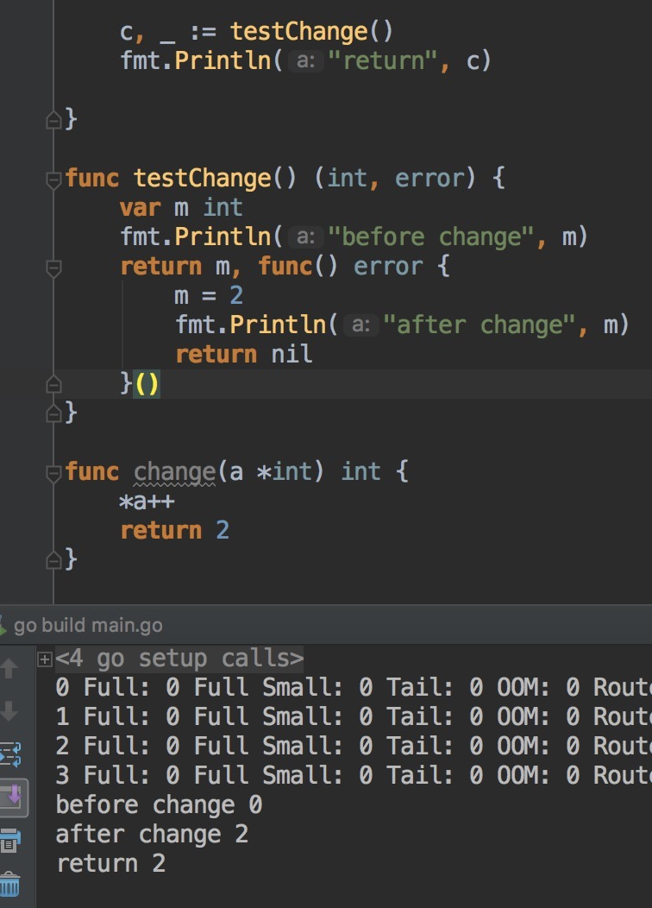

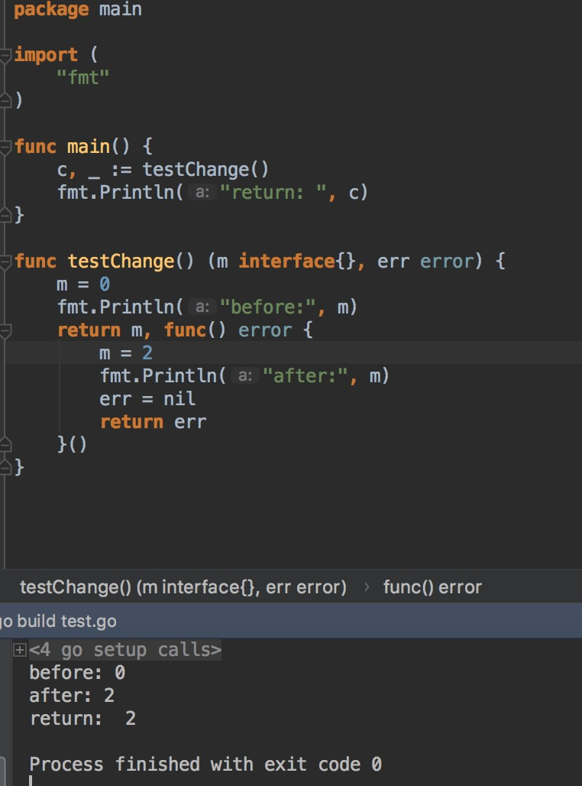
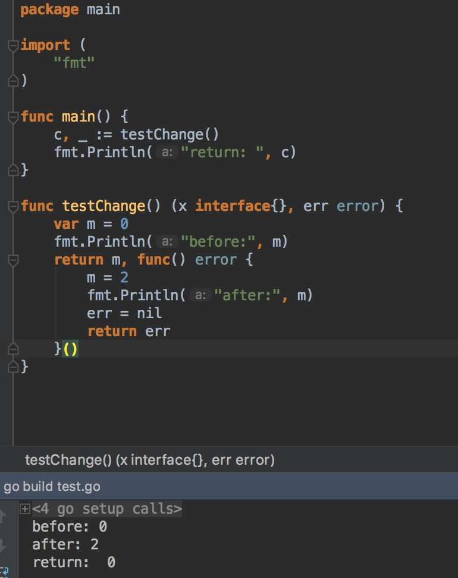
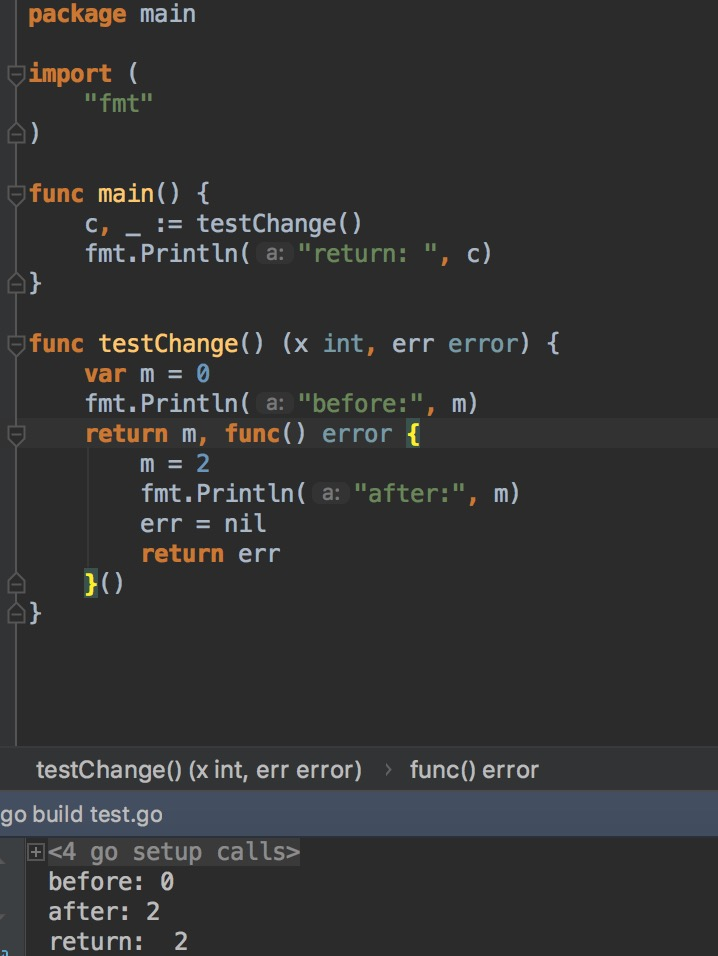
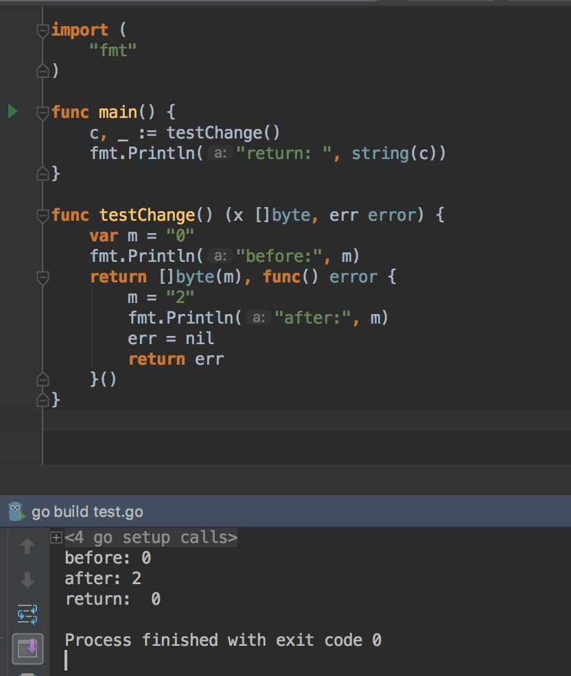
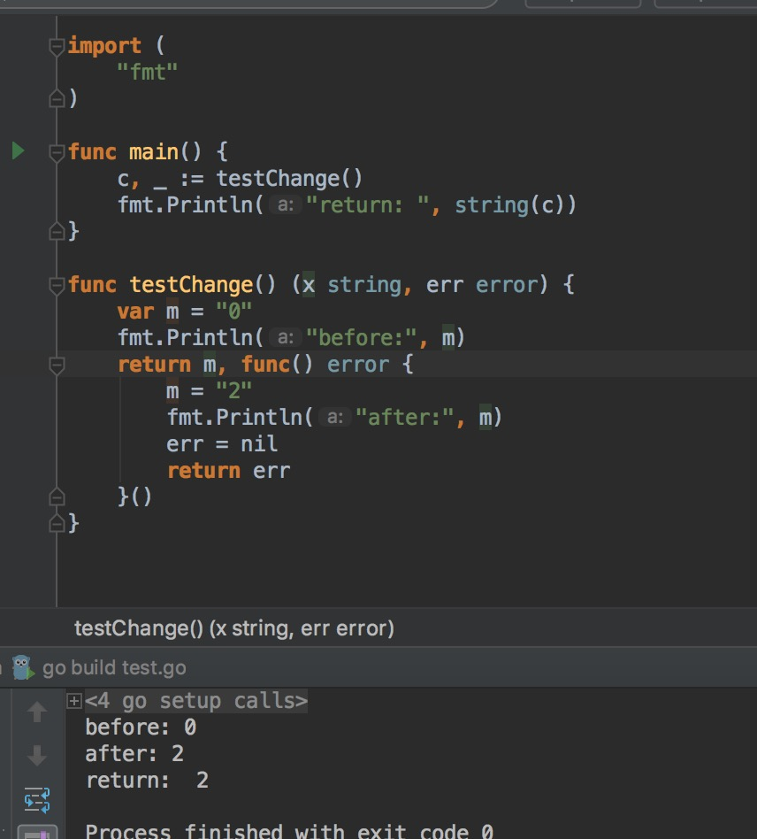
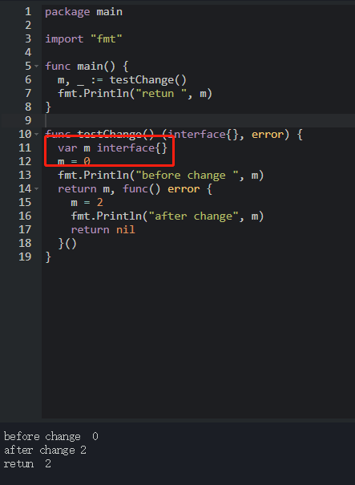
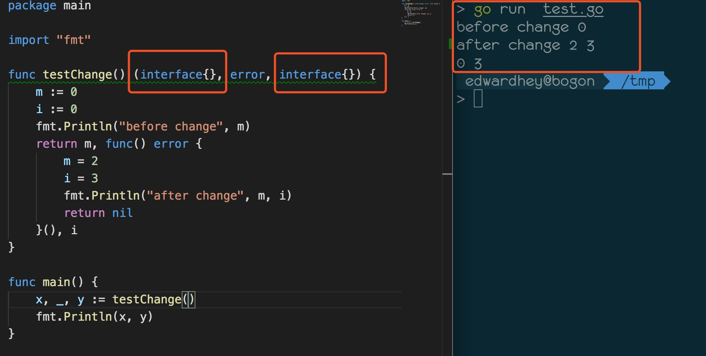
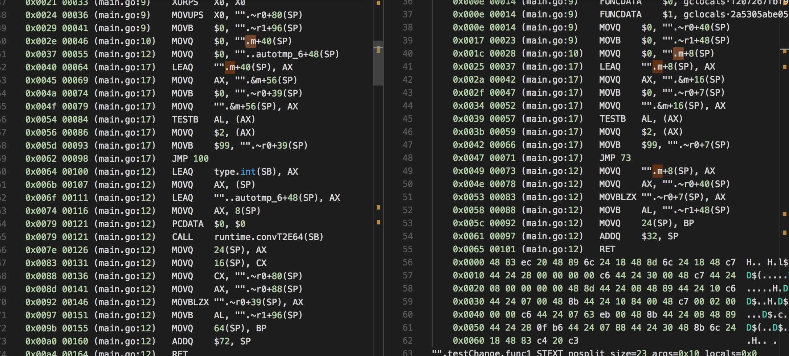

dlv debug 一下，运行顺序是一样的，是不是 golang 的 bug 呢？
看汇编，不是完全看的懂，如果是interface的时候，会申请一个type为int空interface的结构，然后想把m的值复制给data区，但是结果就是没有成功。

## 参考资料

1. [Go 自带 pprof](https://golang.org/pkg/net/http/pprof/)
2. [容器环境下 go 服务性能诊断方案设计与实现](https://mp.weixin.qq.com/s/cn1q0OoJ61cs5mN9Od3dqg)
3. [Golang 逃逸分析](https://sheepbao.github.io/post/golang_escape_analysis/)
4. [spec: order of evaluation of variables in return statement is not determined](https://github.com/golang/go/issues/25609)
5. [spec: Order_of_evaluation](https://golang.org/ref/spec#Order_of_evaluation)