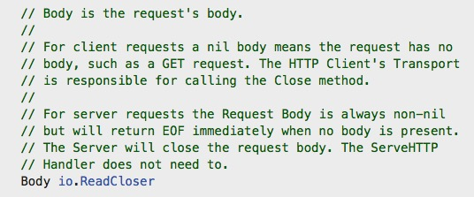

来源：《Go 夜读》微信群

### Request Body 的请求中，不能 bind 两次吗？

```golang
var body struct {
	Fcid string "fcid"
}
c.Bind(&body)
log.Traceln("body", body)
var body2 struct {
	Fcid string "fcid"
}
c.Bind(&body2)
log.Traceln("body2", body2)
```

打印输出结果为：

```sh
2018/09/04 14:58:44.641654 [TRC] jwtValidator.go:34: body {@sign-test2}
2018/09/04 14:58:44.641674 [TRC] jwtValidator.go:41: body2:  {}
```

>Body 不是 is.Seeker 无法 seek，应该不能重复 bind 的。



### protobuf 3 枚举第一个必须是0，但是用的时候，用第一个 struct 会是空

```golang
log.Println(protocol.RESULT_CODE)
xxx := &protocol.XResp{
	Result: protocol.RESULT_CODE,
}
log.Println(xxx)

// OUTPUT:
// 2018-09-06 09:06:00.111 [d] CODE
// 2018-09-06 09:06:00.111 [d] 
```

第一位是占位用的。

## 参考资料

- [Enum value with index 0 not shown #3808](https://github.com/protocolbuffers/protobuf/issues/3808)
- [proto3#enum](https://developers.google.com/protocol-buffers/docs/proto3#enum)
- [In Go, how can I reuse a ReadCloser?](https://stackoverflow.com/questions/33532374/in-go-how-can-i-reuse-a-readcloser)
