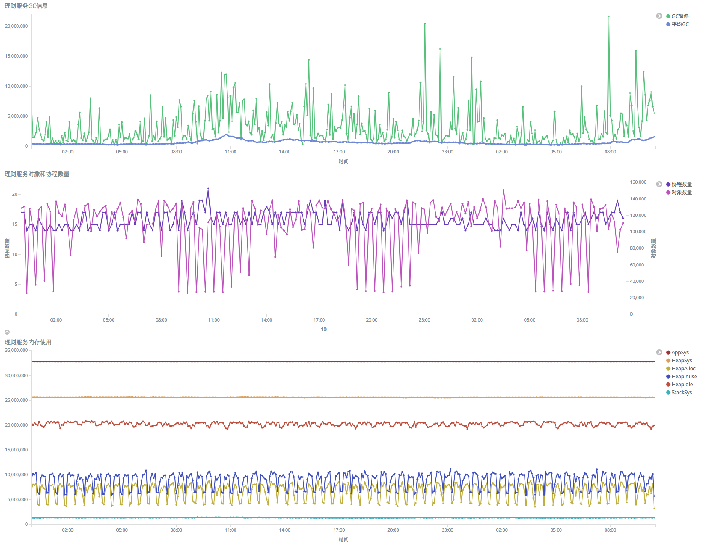

# Golang语言

_1.select是随机的还是顺序的？_

> select会`随机`选择一个可用通用做收发操作

_2.Go语言局部变量分配在栈还是堆？_

> Go语言编译器会自动决定把一个变量放在栈还是放在堆，编译器会做`逃逸分析`，当发现变量的作用域没有跑出函数范围，就可以在栈上，反之则必须分配在堆。
>
> [查看资料](https://www.jianshu.com/p/4e3478e9d252)

_3.简述一下你对Go垃圾回收机制的理解？_

> v1.1 STW           
> v1.3 Mark STW, Sweep 并行        
> v1.5 三色标记法         
> v1.8 hybrid write barrier(混合写屏障：优化STW)       
>
> [Golang垃圾回收剖析](http://legendtkl.com/2017/04/28/golang-gc/)

_4.简述一下golang的协程调度原理?_

> `M(machine)`: 代表着真正的执行计算资源，可以认为它就是os thread（系统线程）。    
> `P(processor)`: 表示逻辑processor，是线程M的执行的上下文。    
> `G(goroutine)`: 调度系统的最基本单位goroutine，存储了goroutine的执行stack信息、goroutine状态以及goroutine的任务函数等。     
> 
> [查看资料](https://github.com/developer-learning/night-reading-go/blob/master/reading/20180802/README.md)

_5.介绍下 golang 的 runtime 机制?_   

> Runtime 负责管理任务调度，垃圾收集及运行环境。同时，Go提供了一些高级的功能，如goroutine, channel, 以及Garbage collection。这些高级功能需要一个runtime的支持. runtime和用户编译后的代码被linker静态链接起来，形成一个可执行文件。这个文件从操作系统角度来说是一个user space的独立的可执行文件。
> 从运行的角度来说，这个文件由2部分组成，一部分是用户的代码，另一部分就是runtime。runtime通过接口函数调用来管理goroutine, channel及其他一些高级的功能。从用户代码发起的调用操作系统API的调用都会被runtime拦截并处理。

> Go runtime的一个重要的组成部分是goroutine scheduler。他负责追踪，调度每个goroutine运行，实际上是从应用程序的process所属的thread pool中分配一个thread来执行这个goroutine。因此，和java虚拟机中的Java thread和OS thread映射概念类似，每个goroutine只有分配到一个OS thread才能运行。

> [相关资料](https://blog.csdn.net/xclyfe/article/details/50562349)

_6.如何获取 go 程序运行时的协程数量, gc 时间, 对象数, 堆栈信息?_   
 
调用接口 runtime.ReadMemStats 可以获取以上所有信息, **注意: 调用此接口会触发 STW(Stop The World)**  
参考: https://golang.org/pkg/runtime/#ReadMemStats

如果需要打入到日志系统, 可以使用 go 封装好的包, 输出 json 格式. 参考:

1. https://golang.org/pkg/expvar/ 
2. http://blog.studygolang.com/2017/06/expvar-in-action/ 

更深入的用法就是将得到的运行时数据导入到 ES 内部, 然后使用 Kibana 做 golang 的运行时监控, 可以实时获取到运行的信息(堆栈, 对象数, gc 时间, goroutine, 总内存使用等等), [具体信息可以看 ReadMemStats 的那个结构体](https://golang.org/pkg/runtime/#MemStats)    

效果大致如下:    

 
_7.介绍下你平时都是怎么调试 golang 的 bug 以及性能问题的?_

> 1. panic 调用栈
> 2. pprof
> 3. 火焰图(配合压测)
> 4. 使用go run -race 或者 go build -race 来进行竞争检测
> 5. 查看系统 磁盘IO/网络IO/内存占用/CPU 占用(配合压测)

_8.简单介绍下 golang 中 make 和 new 的区别_

> new(T) 是为一个 T 类型的新值分配空间, 并将此空间初始化为 T 的零值, 并返回这块内存空间的地址, 也就是 T 类型的指针 *T, 该指针指向 T 类型值占用的那块内存.
> make(T) 返回的是初始化之后的 T, 且只能用于 slice, map, channel 三种类型. make(T, args) 返回初始化之后 T 类型的值, 且此新值并不是 T 类型的零值, 也不是 T 类型的指针 *T, 而是 T 类型值经过初始化之后的引用.
> 参考:
> 1. https://www.cnblogs.com/ghj1976/archive/2013/02/12/2910384.html
> 2. https://studygolang.com/articles/3496